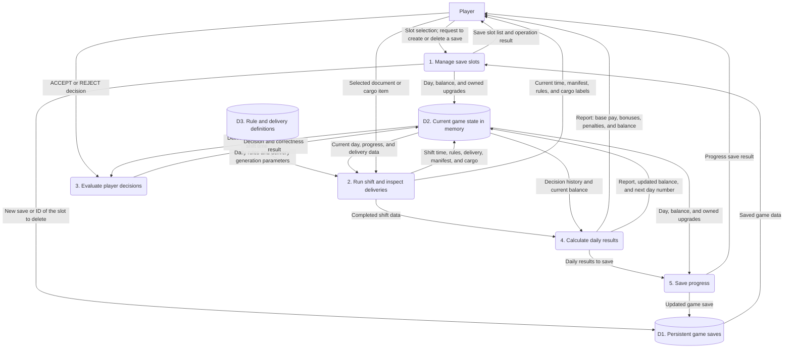

# Data Flow Diagram DFD

```mermaid
flowchart TD
    PLAYER["Player"]

    P1("1. Manage save slots")
    P2("2. Run shift and inspect deliveries")
    P3("3. Evaluate player decisions")
    P4("4. Calculate daily results")
    P5("5. Save progress")

    D1[("D1. Persistent game saves")]
    D2[("D2. Current game state in memory")]
    D3[("D3. Rule and delivery definitions")]

    PLAYER -->|"Slot selection; request to create or delete a save"| P1
    P1 -->|"Save slot list and operation result"| PLAYER
    D1 -->|"Saved game data"| P1
    P1 -->|"New save or ID of the slot to delete"| D1
    P1 -->|"Day, balance, and owned upgrades"| D2

    D3 -->|"Daily rules and delivery generation parameters"| P2
    D2 -->|"Current day, progress, and delivery data"| P2
    P2 -->|"Shift time, rules, delivery, manifest, and cargo"| D2
    PLAYER -->|"Selected document or cargo item"| P2
    P2 -->|"Current time, manifest, rules, and cargo labels"| PLAYER

    PLAYER -->|"ACCEPT or REJECT decision"| P3
    D2 -->|"Delivery data, rules, and shift time"| P3
    P3 -->|"Decision and correctness result"| D2

    P2 -->|"Completed shift data"| P4
    D2 -->|"Decision history and current balance"| P4
    P4 -->|"Report: base pay, bonuses, penalties, and balance"| PLAYER
    P4 -->|"Report, updated balance, and next day number"| D2

    P4 -->|"Daily results to save"| P5
    D2 -->|"Day, balance, and owned upgrades"| P5
    P5 -->|"Updated game save"| D1
    P5 -->|"Progress save result"| PLAYER
```
