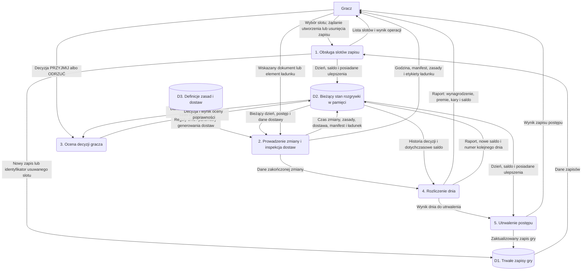

# Diagram Przepływu Danych DFD

```mermaid
flowchart TD
    GRACZ["Gracz"]

    P1("1. Obsługa slotów zapisu")
    P2("2. Prowadzenie zmiany i inspekcja dostaw")
    P3("3. Ocena decyzji gracza")
    P4("4. Rozliczenie dnia")
    P5("5. Utrwalenie postępu")

    D1[("D1. Trwałe zapisy gry")]
    D2[("D2. Bieżący stan rozgrywki w pamięci")]
    D3[("D3. Definicje zasad i dostaw")]

    GRACZ -->|"Wybór slotu; żądanie utworzenia lub usunięcia zapisu"| P1
    P1 -->|"Lista slotów i wynik operacji"| GRACZ
    D1 -->|"Dane zapisów"| P1
    P1 -->|"Nowy zapis lub identyfikator usuwanego slotu"| D1
    P1 -->|"Dzień, saldo i posiadane ulepszenia"| D2

    D3 -->|"Reguły dnia i parametry generowania dostaw"| P2
    D2 -->|"Bieżący dzień, postęp i dane dostawy"| P2
    P2 -->|"Czas zmiany, zasady, dostawa, manifest i ładunek"| D2
    GRACZ -->|"Wskazany dokument lub element ładunku"| P2
    P2 -->|"Godzina, manifest, zasady i etykiety ładunku"| GRACZ

    GRACZ -->|"Decyzja PRZYJMIJ albo ODRZUĆ"| P3
    D2 -->|"Dane dostawy, reguły i czas zmiany"| P3
    P3 -->|"Decyzja i wynik oceny poprawności"| D2

    P2 -->|"Dane zakończonej zmiany"| P4
    D2 -->|"Historia decyzji i dotychczasowe saldo"| P4
    P4 -->|"Raport: wynagrodzenie, premie, kary i saldo"| GRACZ
    P4 -->|"Raport, nowe saldo i numer kolejnego dnia"| D2

    P4 -->|"Wynik dnia do utrwalenia"| P5
    D2 -->|"Dzień, saldo i posiadane ulepszenia"| P5
    P5 -->|"Zaktualizowany zapis gry"| D1
    P5 -->|"Wynik zapisu postępu"| GRACZ
```

