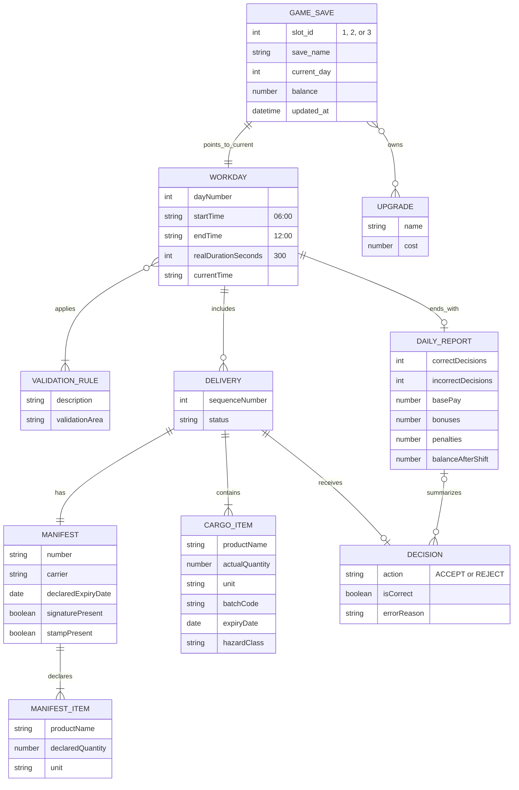

# Entity Relationship Diagram ERD

```mermaid
erDiagram
    direction TB

    GAME_SAVE ||--|| WORKDAY : points_to_current
    GAME_SAVE }o--o{ UPGRADE : owns
    WORKDAY }o--|{ VALIDATION_RULE : applies
    WORKDAY ||--o{ DELIVERY : includes
    DELIVERY ||--|| MANIFEST : has
    MANIFEST ||--|{ MANIFEST_ITEM : declares
    DELIVERY ||--|{ CARGO_ITEM : contains
    DELIVERY ||--o| DECISION : receives
    WORKDAY ||--o| DAILY_REPORT : ends_with
    DAILY_REPORT o|--o{ DECISION : summarizes

    GAME_SAVE {
        int slot_id "1, 2, or 3"
        string save_name
        int current_day
        number balance
        datetime updated_at
    }

    UPGRADE {
        string name
        number cost
    }

    WORKDAY {
        int dayNumber
        string startTime "06:00"
        string endTime "12:00"
        int realDurationSeconds "300"
        string currentTime
    }

    VALIDATION_RULE {
        string description
        string validationArea
    }

    DELIVERY {
        int sequenceNumber
        string status
    }

    MANIFEST {
        string number
        string carrier
        date declaredExpiryDate
        boolean signaturePresent
        boolean stampPresent
    }

    MANIFEST_ITEM {
        string productName
        number declaredQuantity
        string unit
    }

    CARGO_ITEM {
        string productName
        number actualQuantity
        string unit
        string batchCode
        date expiryDate
        string hazardClass
    }

    DECISION {
        string action "ACCEPT or REJECT"
        boolean isCorrect
        string errorReason
    }

    DAILY_REPORT {
        int correctDecisions
        int incorrectDecisions
        number basePay
        number bonuses
        number penalties
        number balanceAfterShift
    }
```
