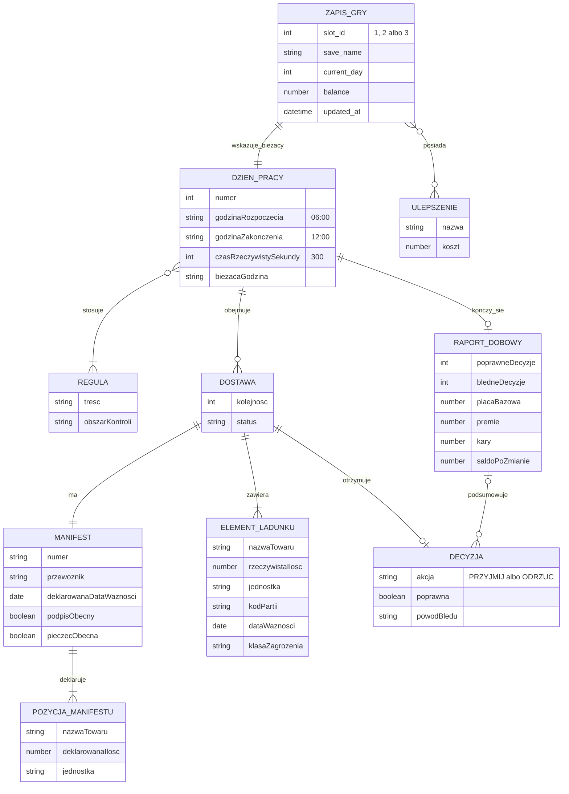

# Diagram Modelu Danych ERD

```mermaid
erDiagram
    direction TB

    ZAPIS_GRY ||--|| DZIEN_PRACY : wskazuje_biezacy
    ZAPIS_GRY }o--o{ ULEPSZENIE : posiada
    DZIEN_PRACY }o--|{ REGULA : stosuje
    DZIEN_PRACY ||--o{ DOSTAWA : obejmuje
    DOSTAWA ||--|| MANIFEST : ma
    MANIFEST ||--|{ POZYCJA_MANIFESTU : deklaruje
    DOSTAWA ||--|{ ELEMENT_LADUNKU : zawiera
    DOSTAWA ||--o| DECYZJA : otrzymuje
    DZIEN_PRACY ||--o| RAPORT_DOBOWY : konczy_sie
    RAPORT_DOBOWY o|--o{ DECYZJA : podsumowuje

    ZAPIS_GRY {
        int slot_id "1, 2 albo 3"
        string save_name
        int current_day
        number balance
        datetime updated_at
    }

    ULEPSZENIE {
        string nazwa
        number koszt
    }

    DZIEN_PRACY {
        int numer
        string godzinaRozpoczecia "06:00"
        string godzinaZakonczenia "12:00"
        int czasRzeczywistySekundy "300"
        string biezacaGodzina
    }

    REGULA {
        string tresc
        string obszarKontroli
    }

    DOSTAWA {
        int kolejnosc
        string status
    }

    MANIFEST {
        string numer
        string przewoznik
        date deklarowanaDataWaznosci
        boolean podpisObecny
        boolean pieczecObecna
    }

    POZYCJA_MANIFESTU {
        string nazwaTowaru
        number deklarowanaIlosc
        string jednostka
    }

    ELEMENT_LADUNKU {
        string nazwaTowaru
        number rzeczywistaIlosc
        string jednostka
        string kodPartii
        date dataWaznosci
        string klasaZagrozenia
    }

    DECYZJA {
        string akcja "PRZYJMIJ albo ODRZUC"
        boolean poprawna
        string powodBledu
    }

    RAPORT_DOBOWY {
        int poprawneDecyzje
        int bledneDecyzje
        number placaBazowa
        number premie
        number kary
        number saldoPoZmianie
    }
```

