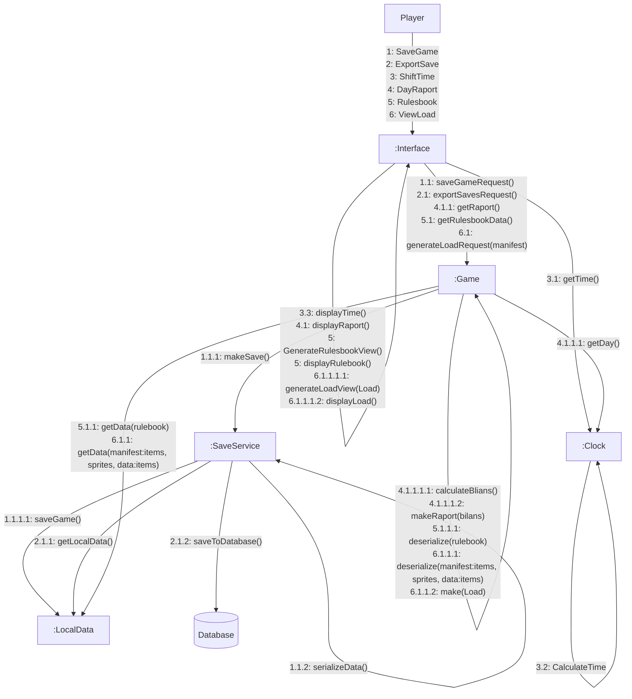
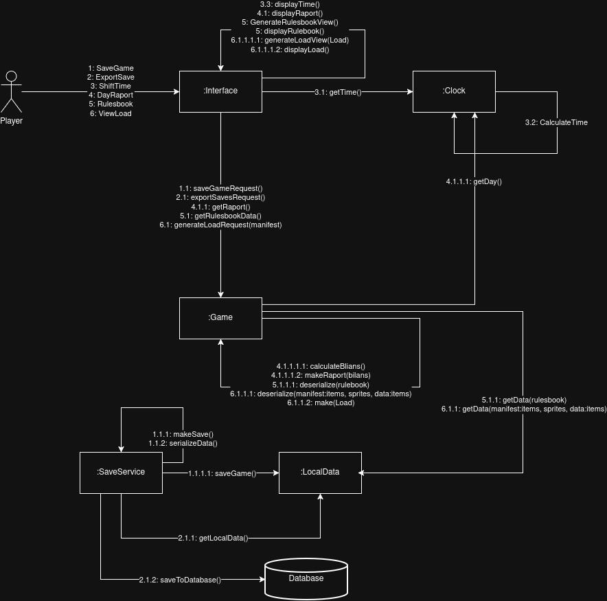

```mermaid
graph TD
    Player[Player]
    Interface[:Interface]
    Clock[:Clock]
    Game[:Game]
    SaveService[:SaveService]
    LocalData[:LocalData]
    Database[(Database)]

    %% Komunikaty od Gracza do Interfejsu
    Player -- "1: SaveGame<br/>2: ExportSave<br/>3: ShiftTime<br/>4: DayRaport<br/>5: Rulesbook<br/>6: ViewLoad" --> Interface

    %% Wywołania własne Interfejsu
    Interface -- "3.3: displayTime()<br/>4.1: displayRaport()<br/>5: GenerateRulesbookView()<br/>5: displayRulebook()<br/>6.1.1.1.1: generateLoadView(Load)<br/>6.1.1.1.2: displayLoad()" --> Interface

    %% Interfejs -> Zegar
    Interface -- "3.1: getTime()" --> Clock
    Clock -- "3.2: CalculateTime" --> Clock

    %% Interfejs -> Gra
    Interface -- "1.1: saveGameRequest()<br/>2.1: exportSavesRequest()<br/>4.1.1: getRaport()<br/>5.1: getRulesbookData()<br/>6.1: generateLoadRequest(manifest)" --> Game

    %% Gra -> Zegar
    Game -- "4.1.1.1: getDay()" --> Clock

    %% Wywołania własne Gry
    Game -- "4.1.1.1.1: calculateBlians()<br/>4.1.1.1.2: makeRaport(bilans)<br/>5.1.1.1: deserialize(rulebook)<br/>6.1.1.1: deserialize(manifest:items, sprites, data:items)<br/>6.1.1.2: make(Load)" --> Game

    %% Gra -> Serwis Zapisów
    Game -- "1.1.1: makeSave()" --> SaveService
    SaveService -- "1.1.2: serializeData()" --> SaveService

    %% Serwis Zapisów -> Dane Lokalne oraz Baza Danych
    SaveService -- "1.1.1.1: saveGame()" --> LocalData
    SaveService -- "2.1.1: getLocalData()" --> LocalData
    SaveService -- "2.1.2: saveToDatabase()" --> Database

    %% Gra -> Dane Lokalne
    Game -- "5.1.1: getData(rulebook)<br/>6.1.1: getData(manifest:items, sprites, data:items)" --> LocalData
```
---

