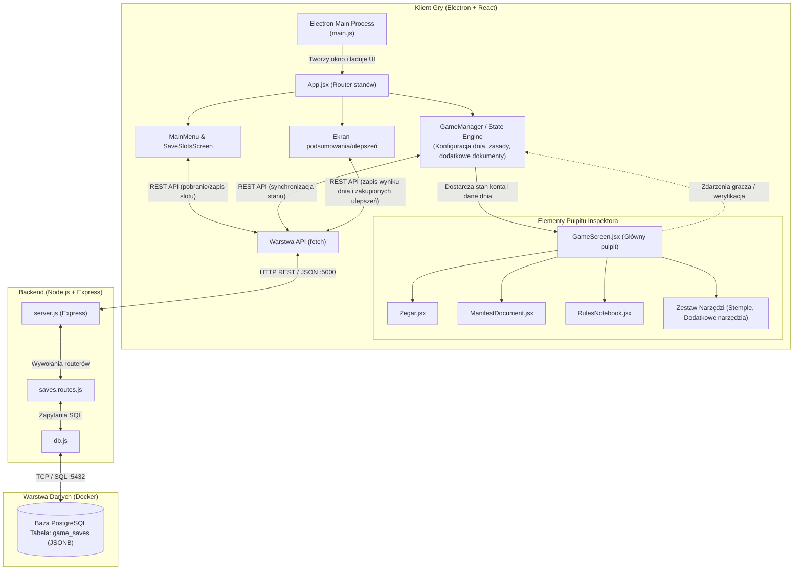

# Diagram Komponentów – WManagment

```mermaid
graph TD
    subgraph Client ["Klient Gry (Electron + React)"]
        Electron["Electron Main Process<br/>(main.js)"] -->|Tworzy okno i ładuje UI| App["App.jsx (Router stanów)"]
        
        App --> Menu["MainMenu & SaveSlotsScreen"]
        App --> Summary["Ekran podsumowania/ulepszeń"]
        App --> GameManager["GameManager / State Engine<br/>(Konfiguracja dnia, zasady, dodatkowe dokumenty)"]

        %% GameManager zasila stanem pulpit
        GameManager -->|Dostarcza stan konta i dane dnia| GameScreen["GameScreen.jsx (Główny pulpit)"]

        subgraph DeskUI ["Elementy Pulpitu Inspektora"]
            GameScreen --> Clock["Zegar.jsx"]
            GameScreen --> Manifest["ManifestDocument.jsx"]
            GameScreen --> Rules["RulesNotebook.jsx"]
            GameScreen --> Tools["Zestaw Narzędzi (Stemple, Dodatkowe narzędzia)"]
        end
        
        %% Akcje z biurka mogą modyfikować stan rozgrywki
        GameScreen -.->|Zdarzenia gracza / weryfikacja| GameManager

        Menu <-- REST API (pobranie/zapis slotu) --> ApiClient["Warstwa API (fetch)"]
        GameManager <-- REST API (synchronizacja stanu) --> ApiClient
        Summary <-- REST API (zapis wyniku dnia i zakupionych ulepszeń) --> ApiClient
    end

    subgraph Backend ["Backend (Node.js + Express)"]
        ApiClient <-- HTTP REST / JSON :5000 --> Server["server.js (Express)"]
        Server <-- Wywołania routerów --> Routes["saves.routes.js"]
        Routes <-- Zapytania SQL --> DbModule["db.js"]
    end

    subgraph DataLayer ["Warstwa Danych (Docker)"]
        DbModule <-- TCP / SQL :5432 --> Postgres[("Baza PostgreSQL<br/>Tabela: game_saves (JSONB)")]
    end
```