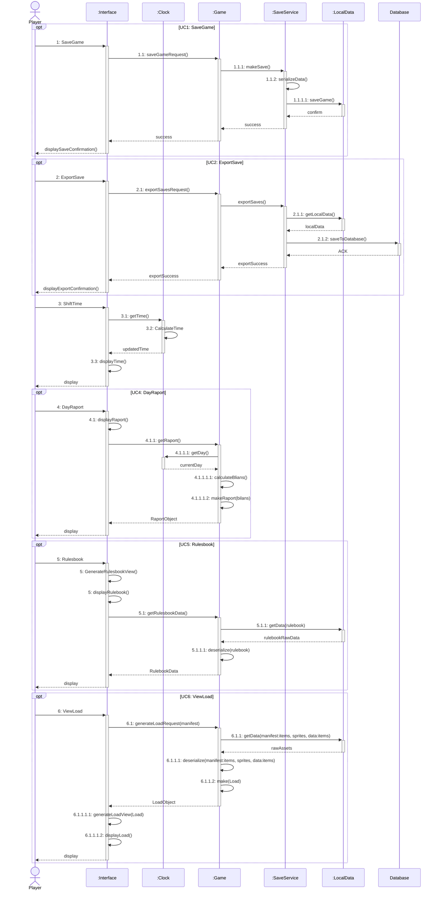

```mermaid
sequenceDiagram
    autonumber off
    actor Player as Player
    participant Interface as :Interface
    participant Clock as :Clock
    participant Game as :Game
    participant SaveService as :SaveService
    participant LocalData as :LocalData
    participant Database as Database

    %% Scenariusz 1: SaveGame (Warunkowy)
    opt UC1: SaveGame
        Player->>+Interface: 1: SaveGame
        Interface->>+Game: 1.1: saveGameRequest()
        Game->>+SaveService: 1.1.1: makeSave()
        SaveService->>SaveService: 1.1.2: serializeData()
        SaveService->>+LocalData: 1.1.1.1: saveGame()
        LocalData-->>-SaveService: confirm
        SaveService-->>-Game: success
        Game-->>-Interface: success
        Interface-->>-Player: displaySaveConfirmation()
    end

    %% Scenariusz 2: ExportSave (Warunkowy)
    opt UC2: ExportSave
        Player->>+Interface: 2: ExportSave
        Interface->>+Game: 2.1: exportSavesRequest()
        Game->>+SaveService: exportSaves()
        SaveService->>+LocalData: 2.1.1: getLocalData()
        LocalData-->>-SaveService: localData
        SaveService->>+Database: 2.1.2: saveToDatabase()
        Database-->>-SaveService: ACK
        SaveService-->>-Game: exportSuccess
        Game-->>-Interface: exportSuccess
        Interface-->>-Player: displayExportConfirmation()
    end

    %% Scenariusz 3: ShiftTime (Bezwarunkowy)
    Player->>+Interface: 3: ShiftTime
    Interface->>+Clock: 3.1: getTime()
    Clock->>Clock: 3.2: CalculateTime
    Clock-->>-Interface: updatedTime
    Interface->>Interface: 3.3: displayTime()
    Interface-->>-Player: display

    %% Scenariusz 4: DayRaport (Warunkowy)
    opt UC4: DayRaport
        Player->>+Interface: 4: DayRaport
        Interface->>Interface: 4.1: displayRaport()
        Interface->>+Game: 4.1.1: getRaport()
        Game->>+Clock: 4.1.1.1: getDay()
        Clock-->>-Game: currentDay
        Game->>Game: 4.1.1.1.1: calculateBlians()
        Game->>Game: 4.1.1.1.2: makeRaport(bilans)
        Game-->>-Interface: RaportObject
        Interface-->>-Player: display
    end

    %% Scenariusz 5: Rulesbook (Warunkowy)
    opt UC5: Rulesbook
        Player->>+Interface: 5: Rulesbook
        Interface->>Interface: 5: GenerateRulesbookView()
        Interface->>Interface: 5: displayRulebook()
        Interface->>+Game: 5.1: getRulesbookData()
        Game->>+LocalData: 5.1.1: getData(rulebook)
        LocalData-->>-Game: rulebookRawData
        Game->>Game: 5.1.1.1: deserialize(rulebook)
        Game-->>-Interface: RulebookData
        Interface-->>-Player: display
    end

    %% Scenariusz 6: ViewLoad (Warunkowy)
    opt UC6: ViewLoad
        Player->>+Interface: 6: ViewLoad
        Interface->>+Game: 6.1: generateLoadRequest(manifest)
        Game->>+LocalData: 6.1.1: getData(manifest:items, sprites, data:items)
        LocalData-->>-Game: rawAssets
        Game->>Game: 6.1.1.1: deserialize(manifest:items, sprites, data:items)
        Game->>Game: 6.1.1.2: make(Load)
        Game-->>-Interface: LoadObject
        Interface->>Interface: 6.1.1.1.1: generateLoadView(Load)
        Interface->>Interface: 6.1.1.1.2: displayLoad()
        Interface-->>-Player: display
    end
```
